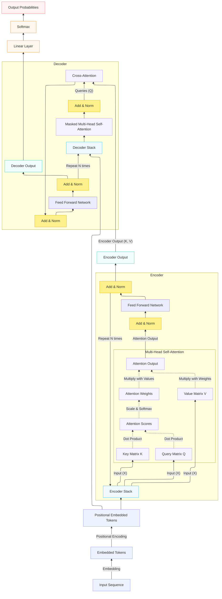

# LLM101 — Build a Language Model From Scratch

A ~15M-parameter GPT-style decoder-only Transformer in ~800 lines of PyTorch.
Every component is written explicitly — RMSNorm, RoPE, SwiGLU, causal self-attention,
weight tying — so you can see exactly how modern LLMs work inside.

Aligned with Sebastian Raschka's
[Build a Large Language Model (From Scratch)](https://github.com/rasbt/LLMs-from-scratch).

## Quick Start

```bash
bash run.sh setup      # venv + PyTorch + TinyStories corpus
bash run.sh verify     # shape test + KV-cache equivalence check
bash run.sh train      # train (~5 min GPU, ~30 min CPU)
bash run.sh generate --fast   # interactive generation with KV cache
bash run.sh ui         # Gradio web console → http://127.0.0.1:7860
```

`run.sh` auto-detects your hardware (NVIDIA GPU / AMD ROCm / CPU + Intel NPU)
and installs the matching PyTorch build. No manual configuration needed.

### Jupyter Notebook

[](https://colab.research.google.com/github/rahulbasu-dev/llm101/blob/main/LLM101_From_Scratch.ipynb)

**`LLM101_From_Scratch.ipynb`** covers the complete pipeline in 10 sections:
config → tokenizer → dataset → model architecture → forward pass visualization →
training → generation → attention heatmaps → KV cache deep dive.
Works on both GPU and CPU (auto-detected).

## Architecture

### Background: the Transformer family

The original Transformer (Vaswani et al., 2017) had both an encoder and a
decoder, with cross-attention linking them — useful for translation, where
the encoder digests the source sentence and the decoder generates the
target. **LLM101 implements only the decoder side** (the right half of the
diagram below), which is the dominant pattern for modern autoregressive LMs
like GPT and LLaMA: no encoder, no cross-attention, every token attends
only to itself and earlier tokens.



### Full architecture — tokens to next-token

The complete decoder-only stack: input tokens → embedding → six stacked
TransformerBlocks → final RMSNorm → `lm_head` → sampling. The
`Transformer_Block_Detail` subgraph (linked to `Block 0` and `Block 5` to
indicate every block shares this structure) shows what runs inside each
block, and the `KV Cache` subgraph shows how cached K and V tensors splice
into attention during `generate_fast()`.

```mermaid
---
config:
  layout: elk
---
flowchart BT
 subgraph Input_Embeddings["Input Embeddings"]
        Emb["Token Embedding<br>(vocab → d_model=384)"]
        Tokens["Input Tokens (B, T)"]
        Drop0["Dropout (0.1)"]
        Note_NoPos["<i>No positional embedding —<br>RoPE applied inside attention</i>"]
  end
 subgraph Transformer_Blocks["Transformer Blocks (×6)"]
    direction TB
        Block0["Block 0"]
        Block1["Block 1"]
        Block2["Block 2"]
        Block3["Block 3"]
        Block4["Block 4"]
        Block5["Block 5"]
  end
 subgraph Transformer_Block_Detail["Transformer Block Detail (Pre-Norm)"]
    direction TB
        RMS1["RMSNorm"]
        LIn["x (B, T, 384)"]
        QKV["Combined QKV Projection<br>(384 → 1152)"]
        Split["Split → Q, K, V<br>(B, 6, T, 64) each"]
        RoPE["RoPE<br>(rotate Q, K by position)"]
        Scores["Q · Kᵀ / √64"]
        Mask["Causal Mask<br>(upper triangle → −∞)"]
        Softmax_Attn["Softmax → Attention Weights"]
        WeightedV["Weights · V"]
        OutProj["Output Projection<br>(384 → 384)"]
        Drop1["Dropout"]
        Res1(("+ Residual"))
        RMS2["RMSNorm"]
        Gate["gate_proj (384 → 1024)"]
        Up["up_proj (384 → 1024)"]
        SiLU["SiLU(gate)"]
        Mul(("⊙ element-wise"))
        Down["down_proj (1024 → 384)"]
        Drop2["Dropout"]
        Res2(("+ Residual"))
        LOut["Output (B, T, 384)"]
  end
 subgraph KV_Cache["KV Cache (generate_fast)"]
    direction LR
        ConcatK["concat(past_K, new_K)"]
        PastK["Cached K<br>(B, 6, past_T, 64)"]
        ConcatV["concat(past_V, new_V)"]
        PastV["Cached V<br>(B, 6, past_T, 64)"]
  end
 subgraph Output_Head["Output Head"]
    direction TB
        RMSFinal["RMSNorm"]
        LMHead["lm_head<br>(384 → vocab)"]
        Logits["Logits (B, T, vocab)"]
        Sampling["Temperature → Top-k → Top-p<br>→ Sample"]
        NextTok["Next Token"]
  end
    Tokens --> Emb
    Emb --> Drop0
    Drop0 --> Block0
    Block0 --> Block1
    Block1 --> Block2
    Block2 --> Block3
    Block3 --> Block4
    Block4 --> Block5
    LIn --> RMS1 & Res1
    RMS1 --> QKV
    QKV --> Split
    Split --> RoPE
    RoPE --> Scores
    Scores --> Mask
    Mask --> Softmax_Attn
    Softmax_Attn --> WeightedV
    WeightedV --> OutProj
    OutProj --> Drop1
    Drop1 --> Res1
    Res1 --> RMS2 & Res2
    RMS2 --> Gate & Up
    Gate --> SiLU
    SiLU --> Mul
    Up --> Mul
    Mul --> Down
    Down --> Drop2
    Drop2 --> Res2
    Res2 --> LOut
    PastK --> ConcatK
    PastV --> ConcatV
    ConcatK --> Scores
    ConcatV --> WeightedV
    Block5 --> RMSFinal
    RMSFinal --> LMHead
    LMHead --> Logits
    Logits --> Sampling
    Sampling --> NextTok
    Emb -. shared weight .-> LMHead
    Block0 -.- Transformer_Block_Detail
    Block5 -.- Transformer_Block_Detail

    style Tokens fill:#e8b4f8,stroke:#333,stroke-width:2px
    style Emb fill:#b8d4f0,stroke:#333,stroke-width:1px
    style QKV fill:#fff3b0,stroke:#333,stroke-width:1px
    style Split fill:#fff3b0,stroke:#333,stroke-width:1px
    style RoPE fill:#ffd6a5,stroke:#333,stroke-width:2px
    style Scores fill:#fff3b0,stroke:#333,stroke-width:1px
    style Mask fill:#ffb3b3,stroke:#333,stroke-width:1px
    style Softmax_Attn fill:#fff3b0,stroke:#333,stroke-width:2px
    style WeightedV fill:#fff3b0,stroke:#333,stroke-width:1px
    style OutProj fill:#fff3b0,stroke:#333,stroke-width:1px
    style Res1 fill:#fff,stroke:#333,stroke-width:2px
    style Gate fill:#b8e6d0,stroke:#333,stroke-width:1px
    style Up fill:#b8e6d0,stroke:#333,stroke-width:1px
    style SiLU fill:#b8e6d0,stroke:#333,stroke-width:2px
    style Mul fill:#fff,stroke:#333,stroke-width:2px
    style Down fill:#b8e6d0,stroke:#333,stroke-width:1px
    style Res2 fill:#fff,stroke:#333,stroke-width:2px
    style PastK fill:#d4e6ff,stroke:#336,stroke-width:1px
    style PastV fill:#d4e6ff,stroke:#336,stroke-width:1px
    style LMHead fill:#b8d4f0,stroke:#333,stroke-width:1px
    style Logits fill:#c8f0c8,stroke:#333,stroke-width:2px
    style Sampling fill:#ffd6a5,stroke:#333,stroke-width:2px
    style NextTok fill:#c8f0c8,stroke:#333,stroke-width:2px
    style Transformer_Block_Detail fill:#fffff0,stroke:#333
    style Input_Embeddings fill:#fafafa,stroke:#333,stroke-dasharray: 5 5
    style Transformer_Blocks fill:#eaeaea,stroke:#333,stroke-dasharray: 5 5
    style KV_Cache fill:#e8f0ff,stroke:#336,stroke-dasharray: 5 5
    style Output_Head fill:#fafafa,stroke:#333,stroke-dasharray: 5 5
```



### Inside one TransformerBlock — annotated

Same block as in the diagram above, drawn at higher zoom with formulas and
the three key concepts called out: **Pre-Norm** (normalize before, not
after), **Residual connections** (preserve gradient flow), and the
**Attention-as-routing / FFN-as-computation** distinction.

```mermaid
flowchart BT
 subgraph SwiGLU["SwiGLU (3 matrices, not 2)"]
    direction LR
        SiLU["SiLU<br><i>x · σ(x)</i>"]
        G["gate_proj<br>(384 → 1024)"]
        ElemMul(("⊙"))
        U["up_proj<br>(384 → 1024)"]
        D["down_proj<br>(1024 → 384)"]
  end
 subgraph TransformerBlock["Transformer Block (Pre-Norm Residual)"]
    direction TB
        Input["<b>x</b><br>(B, T, 384)"]
        RMS1["<b>RMSNorm</b><br>normalize without centering<br><i>output = x · rsqrt(mean(x²) + ε) · γ</i>"]
        QKV["<b>Combined QKV Projection</b><br>single Linear(384 → 1152)<br><i>one matmul instead of three</i>"]
        Split["<b>Split into Q, K, V</b><br>chunk(3) → each (B, T, 384)<br>reshape → (B, <b>6 heads</b>, T, <b>64 dims</b>)"]
        RoPE["<b>Rotary Position Embedding</b><br>rotate Q and K by position angle<br><i>θᵢ = 10000<sup>−2i/64</sup></i><br>dot product captures <b>relative</b> position"]
        DotProd["<b>Scaled Dot-Product</b><br>scores = Q · Kᵀ / √64<br><i>measures how much each token<br>should attend to every other</i>"]
        CausalMask["<b>Causal Mask</b><br>upper triangle → −∞<br><i>token i can only see tokens 0..i<br>(no peeking at future)</i>"]
        Softmax["<b>Softmax</b><br>each row → probability distribution<br><i>rows sum to 1.0</i>"]
        ValueMix@{ label: "<b>Weighted Value Sum</b><br>output = weights · V<br><i>each token becomes a weighted<br>mix of other tokens' values</i>" }
        OutProj["<b>Output Projection</b><br>Linear(384 → 384)<br>+ Dropout(0.1)"]
        Res1(("<b>+</b>"))
        RMS2["<b>RMSNorm</b>"]
        GateUp["<b>SwiGLU Feed-Forward</b>"]
        SwiGLU
        Drop2["Dropout(0.1)"]
        Res2(("<b>+</b>"))
        Output["<b>output</b><br>(B, T, 384)<br><i>same shape as input —<br>ready for the next block</i>"]
  end
    Input --> RMS1 & Res1
    RMS1 --> QKV
    QKV --> Split
    Split --> RoPE
    RoPE --> DotProd
    DotProd --> CausalMask
    CausalMask --> Softmax
    Softmax --> ValueMix
    ValueMix --> OutProj
    OutProj --> Res1
    Res1 --> RMS2 & Res2
    RMS2 --> GateUp
    G --> SiLU
    U --> ElemMul
    SiLU --> ElemMul
    ElemMul --> D
    GateUp --> G & U
    D --> Drop2
    Drop2 --> Res2
    Res2 --> Output
    Note1["🔑 <b>Pre-Norm</b>: normalize <i>before</i><br>the sublayer, not after.<br>More stable for deep stacks."] ~~~ Input
    Note2["🔑 <b>Residual connections</b>:<br>add the input back after each<br>sublayer. Lets gradients flow<br>through 6 layers without vanishing."] ~~~ Res1
    Note3["🔑 <b>Attention = routing</b><br>decides WHICH tokens to mix.<br><b>FFN = computation</b><br>stores and retrieves knowledge."] ~~~ Output

    ValueMix@{ shape: rect}
    style Input fill:#e8b4f8,stroke:#333,stroke-width:2px
    style RMS1 fill:#f0e6ff,stroke:#333
    style QKV fill:#fff3b0,stroke:#333
    style Split fill:#fff3b0,stroke:#333
    style RoPE fill:#ffd6a5,stroke:#333,stroke-width:2px
    style DotProd fill:#fff3b0,stroke:#333
    style CausalMask fill:#ffb3b3,stroke:#333,stroke-width:2px
    style Softmax fill:#fff3b0,stroke:#333,stroke-width:2px
    style ValueMix fill:#fff3b0,stroke:#333
    style OutProj fill:#fff3b0,stroke:#333
    style Res1 fill:#fff,stroke:#f59e0b,stroke-width:3px
    style RMS2 fill:#f0e6ff,stroke:#333
    style G fill:#b8e6d0,stroke:#333
    style SiLU fill:#b8e6d0,stroke:#333,stroke-width:2px
    style U fill:#b8e6d0,stroke:#333
    style ElemMul fill:#fff,stroke:#333,stroke-width:2px
    style D fill:#b8e6d0,stroke:#333
    style Drop2 fill:#f0f0f0,stroke:#333
    style Res2 fill:#fff,stroke:#f59e0b,stroke-width:3px
    style Output fill:#c8f0c8,stroke:#333,stroke-width:2px
    style Note1 fill:#fffff0,stroke:#999,stroke-dasharray: 3 3
    style Note2 fill:#fffff0,stroke:#999,stroke-dasharray: 3 3
    style Note3 fill:#fffff0,stroke:#999,stroke-dasharray: 3 3
    style SwiGLU fill:#e8f5e9,stroke:#333,stroke-dasharray: 5 5
    style TransformerBlock fill:#fafafa,stroke:#333
```



### KV-cache decoding

`generate_fast()` caches K,V per layer so each decode step is O(T) instead of O(T²):

1. **Prefill**: full forward on prompt → collect caches, apply causal mask, RoPE at `start_pos=0`
2. **Decode loop**: single-token forward, concat new K,V to cache, RoPE at `start_pos=past_len`, no causal mask needed

Equivalence verified by `test_kv_cache_matches_full_pass` (max |Δlogit| < 1e-4).

### Design choices

| Component | Choice | Classical alternative |
|---|---|---|
| Normalization | **RMSNorm** | LayerNorm |
| Positional encoding | **RoPE** | Sinusoidal / learned |
| FFN activation | **SwiGLU** | ReLU / GELU |
| Norm placement | **Pre-Norm** | Post-Norm |
| Output projection | **Weight-tied** with embedding | Separate weights |
| Attention projection | **Combined QKV** | Separate Q, K, V |

## Web UI

`bash run.sh ui` launches a Gradio console with 6 tabs:

| Tab | Purpose |
|-----|---------|
| **Train** | Interactive training with hyperparameter sliders, live loss curve |
| **Train Reports** | 16-step forward pass walkthrough with pin-and-compare + PPTX export |
| **Attention** | Per-head heatmap + attention rollout across all layers |
| **Visualize** | Animated three-panel view: architecture + all-heads grid + activation norms |
| **Generate** | Token-by-token streaming with temperature/top_k/top_p controls |
| **Benchmark** | Side-by-side generate() vs generate_fast() speed comparison |

## Files

| File | Purpose |
|------|---------|
| `config.py` | All hyperparameters in one dataclass + hardware detection |
| `tokenizer.py` | Byte-level BPE tokenizer (from scratch, ~200 lines) |
| `model.py` | Full Transformer: RMSNorm, RoPE, Attention, SwiGLU, NanoLLM |
| `dataset.py` | Sliding-window dataset for causal LM |
| `train.py` | Training loop: torch.compile, mixed precision, warmup + cosine LR |
| `generate.py` | Interactive generation with top-k + nucleus sampling |
| `teach.py` | Hook-based 16-slide forward-pass walkthrough |
| `visualise.py` | Attention heatmaps and rollout analysis |
| `visualize_anim.py` | Tensor collection for the animated visualization tab |
| `app.py` | Gradio web console (6 tabs) |
| `tests/` | 55-test pytest suite (CPU-only, ~15s) |
| `run.sh` | One-command dispatcher for all workflows |
| `LLM101_From_Scratch.ipynb` | Comprehensive Jupyter notebook (48 cells, 10 sections) |

## Hyperparameters

| Parameter | Value | Notes |
|-----------|-------|-------|
| d_model | 384 | Hidden dimension |
| n_layers | 6 | Transformer blocks |
| n_heads | 6 | Attention heads (d_head=64) |
| d_ff | 1536 | FFN intermediate (4× d_model) |
| max_seq_len | 256 | Context window |
| vocab_size | ~4096 | BPE on TinyStories |
| batch_size | 64 | Adjustable via CLI/UI |
| learning_rate | 3e-4 | AdamW with cosine decay |

## Commands

```bash
bash run.sh setup       # venv + PyTorch (auto-detects GPU) + corpus
bash run.sh verify      # GPU check + model shapes + tokenizer + training time estimate
bash run.sh train       # full training (--max-epochs 3 for quick test)
bash run.sh generate    # interactive generation (add --fast for KV cache)
bash run.sh benchmark   # generate() vs generate_fast() timing
bash run.sh teach       # 16 teaching slides → teaching_plots/
bash run.sh visualise   # attention heatmaps → attention_plots/
bash run.sh test        # pytest suite (CPU, no GPU needed)
bash run.sh ui          # Gradio web console
```

## License

Educational use. Built for learning, not production.
