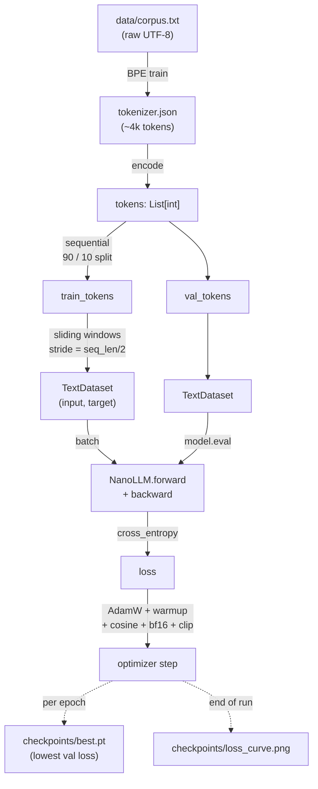

# NanoLLM — Build a Language Model From Scratch

A complete, annotated GPT-style Transformer language model in ~800 lines of PyTorch.
Every component is written from scratch with detailed comments explaining **what** and **why**.

**Built to teach.** Ships with a 16-slide step-by-step visualization of one prompt
flowing through the network, a KV-cache speedup demo, and a train/val loss curve.
Aligned with Sebastian Raschka's
[Build a Large Language Model (From Scratch)](https://github.com/rasbt/LLMs-from-scratch)
— see [REFERENCES.md](REFERENCES.md) for the slide ↔ chapter cross-walk.

> **Requires CUDA.** The app entry points (`train`, `generate`, `teach`, `ui`, `visualise`)
> hard-require a CUDA-capable GPU via `config.require_cuda()`. `bash run.sh setup`
> installs the `cu121` build of PyTorch. For quick CPU-only exploration:
> `NANOLLM_ALLOW_CPU=1 bash run.sh ui` (training will be impractically slow).

## Architecture

### 1. End-to-end pipeline



### 2. Model internals — one forward pass

```
idx : (B, T)                                                     [input token IDs]
  │
  ▼
token_emb (vocab→d_model)  ──── weight-tied with lm_head ────┐
  │                                                           │
  │  emb_dropout                                              │
  ▼                                                           │
x : (B, T, d_model=384)                                       │
  │                                                           │
  ├──────────────────── × n_layers=6 ────────────────────┐    │
  │ ┌────────────────────── TransformerBlock ──────────┐ │    │
  │ │                                                  │ │    │
  │ │  ┌── RMSNorm(attn_norm) ──┐                     │ │    │
  │ │  │                         │                     │ │    │
  │ │  ▼                         │                     │ │    │
  │ │  CausalSelfAttention       │                     │ │    │
  │ │  │                         │                     │ │    │
  │ │  │  qkv_proj  →  Q,K,V : (B, nh=6, T, d_head=64) │    │
  │ │  │  RoPE(Q), RoPE(K)  at start_pos (see §3)      │    │
  │ │  │  scores = Q·Kᵀ / √d_head                      │    │
  │ │  │  masked_fill(upper triangle = −∞)  [prefill]  │    │
  │ │  │  softmax → attn_weights                       │    │
  │ │  │  out = attn_weights · V                       │    │
  │ │  │  out_proj + resid_dropout                     │    │
  │ │  ▼                         │                     │ │    │
  │ │  + x   ◄─── residual ──────┘                     │ │    │
  │ │  │                                                 │ │    │
  │ │  │  ┌── RMSNorm(ffn_norm) ──┐                     │ │    │
  │ │  │  │                        │                     │ │    │
  │ │  ▼  ▼                        │                     │ │    │
  │ │  FeedForward (SwiGLU)        │                     │ │    │
  │ │  │   silu(gate_proj(x)) ⊙ up_proj(x)  →  down_proj │    │
  │ │  ▼                            │                     │ │    │
  │ │  + x   ◄─── residual ─────────┘                     │ │    │
  │ └──────────────────────────────────────────────────┘ │    │
  │                                                       │    │
  └───────────────────────────────────────────────────────┘    │
  │                                                             │
  ▼                                                             │
norm_f (RMSNorm)                                                │
  │                                                             │
  ▼                                                             │
lm_head ◄──────── shared weight ─────────────────────────────────┘
  │
  ▼
logits : (B, T, vocab_size)        [training]
logits : (B, vocab_size)           [inference — last position only]
```

### 3. KV-cache decoding (`generate_fast`)

Reference `generate()` reprocesses the whole context each step.
`generate_fast()` caches K,V so the decode step is O(total_len) not O(total_len²).

```
┌──────────────────────────── PREFILL (T = prompt_len, past_kv = None) ───────────┐
│                                                                                  │
│    prompt ──► model(idx=prompt, past_kv=None) ──► (logits, cache₀)              │
│                                                                                  │
│      cache₀ = [(K_layer0, V_layer0), …, (K_layer5, V_layer5)]                    │
│                 each shape (B, nh, T, d_head)                                    │
│                 causal mask IS applied here                                      │
│                 RoPE uses start_pos = 0                                          │
└──────────────────────────────────────────────────────────────────────────────────┘
                                       │
                                       ▼
             sample_next(logits)  ──►  next_token : (B, 1)
                                       │
┌──────────────────────────────────────▼───────────────────────────────────────────┐
│                                DECODE STEP k (T = 1)                             │
│                                                                                  │
│    next_token ──► model(idx=next_token, past_kv=cacheₖ)                          │
│       │                                                                          │
│       ├─ Q,K,V for the single new token :  (B, nh, 1, d_head)                    │
│       ├─ RoPE uses start_pos = past_len                     ← key correctness!  │
│       ├─ concat(cacheₖ.K, new_K)  →  (B, nh, past_len+1, d_head)                 │
│       ├─ concat(cacheₖ.V, new_V)  →  (B, nh, past_len+1, d_head)                 │
│       ├─ NO causal mask  (single query is always newest position)                │
│       └─ attention: (B, nh, 1, past_len+1) @ V                                   │
│                                                                                  │
│       ──► (logits, cacheₖ₊₁)                                                     │
│                                                                                  │
│    loop:  sample_next ──► next_token ──► repeat until max_new_tokens or limit    │
└──────────────────────────────────────────────────────────────────────────────────┘
```

The equivalence `max |Δlogit| < 1e-4` between the two paths is verified by
`test_model.py::test_kv_cache_matches_full_pass` and the multi-step variant.

### Design choices (modern LLM stack)

| Component | Choice | Alternative (classical) |
|---|---|---|
| Normalization | **RMSNorm** | LayerNorm |
| Positional | **RoPE** | Sinusoidal / learned |
| FFN activation | **SwiGLU** | ReLU / GELU |
| Norm placement | **Pre-Norm** | Post-Norm |
| Output projection | **Weight-tied** with `token_emb` | Separate weights |
| Attention projection | **Combined QKV** | Separate Q, K, V matmuls |

**~15M parameters** — trains in 5–15 minutes on RTX 4080.

## Quick Start

```bash
# 1. Setup (installs PyTorch, downloads TinyShakespeare)
bash run.sh setup

# 2. Verify shapes + KV-cache equivalence
bash run.sh verify

# 3. Train (saves loss_curve.png, picks best checkpoint on VAL loss)
bash run.sh train

# 4. Generate text interactively (use --fast for KV-cache path)
bash run.sh generate --fast

# 5. Show the 10-100x KV-cache speedup
bash run.sh benchmark

# 6. 16-slide step-by-step forward-pass walkthrough
bash run.sh teach

# 7. Attention heatmaps + rollout
bash run.sh visualise

# 8. Run the test suite (pytest, CPU-only, no real data needed)
bash run.sh test

# 9. Launch the Gradio webinar console (browser UI)
bash run.sh ui                  # local   → http://127.0.0.1:7860
bash run.sh ui --share          # public URL (webinar mode)
bash run.sh ui --host 0.0.0.0   # expose on LAN
```

## Web UI — Gradio Webinar Console

A single-page browser app (`app.py`) with four tabs:

| Tab | Shows |
|------|-------|
| **Generate**    | Prompt box + sliders (temp/top-k/top-p/max_tokens), toggle KV cache on/off. **Tokens stream in token-by-token** so the audience sees the autoregressive loop happening |
| **Teach**       | Renders the 16-slide forward-pass walkthrough on-the-fly for any prompt + layer + head (re-runs forward hooks; no disk caching) |
| **Attention**   | Single-head heatmap + attention rollout across all layers, for any prompt |
| **Benchmark**   | One-click `generate()` vs `generate_fast()` comparison — bar chart with tok/s and speedup factor |
| **Build Steps** | 12-step interactive tour of how this project was assembled — config → tokenizer → dataset → model → training → generation → KV cache → teach → visualise → UI → tests → run. Each step has a markdown explanation + a visualisation (see also `BUILDING.md`) |

Launch with `bash run.sh ui`. Without a trained checkpoint it uses random weights and shows a banner reminder — the UI still renders, useful for demoing the architecture alone.

## Files

| File | Purpose |
|------|---------|
| `config.py` | All hyperparameters in one dataclass |
| `tokenizer.py` | Byte-level BPE tokenizer (from scratch) |
| `model.py` | Full Transformer: RMSNorm, RoPE, Attention, SwiGLU, NanoLLM |
| `dataset.py` | Sliding-window dataset for causal LM |
| `train.py` | Training loop: mixed-precision, warmup, cosine LR, checkpointing |
| `generate.py` | Interactive generation with top-k + nucleus sampling |
| `visualise.py` | Attention heatmaps and rollout analysis |
| `teach.py` | **16-slide forward-pass walkthrough** (tokenization → sampling) |
| `app.py` | **Gradio webinar console** — 5-tab browser UI |
| `build_viz.py` | Structural-diagram generators (pipeline, block, KV flow, etc.) for the Build Steps tab |
| `BUILDING.md` | Step-by-step build tutorial (the source for the Build Steps tab) |
| `tests/` | 48-test pytest suite (CPU-only, mock corpus, ~18s incl. UI smoke) |
| `run.sh` | One-command setup/train/generate/visualise/teach/benchmark/test/ui |
| `REFERENCES.md` | Slide-to-Raschka-chapter cross-walk |
| `docs/superpowers/specs/` | Design docs for enhancements |

## Hyperparameters

| Parameter | Value | Why |
|-----------|-------|-----|
| d_model | 384 | Enough capacity for language patterns |
| n_layers | 6 | Deep enough for interesting attention patterns |
| n_heads | 6 | 64-dim per head (standard) |
| d_ff | 1536 | 4× d_model (standard ratio) |
| max_seq_len | 256 | Short but sufficient for demo |
| vocab_size | ~4096 | BPE on small corpus |
| batch_size | 64 | Fills RTX 4080 VRAM well |
| learning_rate | 3e-4 | Standard for small models |

## What to Show in a Webinar

1. **model.py** — walk through each class, explain the architecture evolution
2. **`run.sh teach`** — step through 16 annotated slides (tokenization → embedding
   → Q/K/V → causal mask → softmax → value-weighted sum → multi-head → FFN →
   RoPE → temperature → greedy-vs-sample → parameter breakdown)
3. **Training loss curve** (`checkpoints/loss_curve.png`) — train vs val,
   watch loss drop from ~8.3 (random) to ~3–4 without overfitting
4. **`run.sh benchmark`** — before/after KV-cache speedup, the "inference
   optimization" money-shot
5. **Generation samples** (`run.sh generate --fast`) — interactive demo with
   KV cache live
6. **Attention heatmaps** (`run.sh visualise`) — per-head patterns + rollout
7. **Scaling table** — compare NanoLLM to LLaMA-2 7B to GPT-4

## New features (beyond Raschka)

- **KV cache + `generate_fast()`** — decode step is O(total_len) instead of
  O(total_len²). Equivalence to the reference `generate()` is validated by
  a smoke test in `model.py:__main__` (checks `max |Δlogit| < 1e-4`).
- **Val split** — sequential 90/10, best checkpoint picked on *val* loss.
- **Loss curve PNG** — `checkpoints/loss_curve.png` with train per-step,
  train per-epoch, val per-epoch, log-scale y.
- **16 teaching slides** — `teach.py` hooks intermediate tensors to render
  one prompt's full journey through the model.

## License

Educational use. Built for learning, not production.
